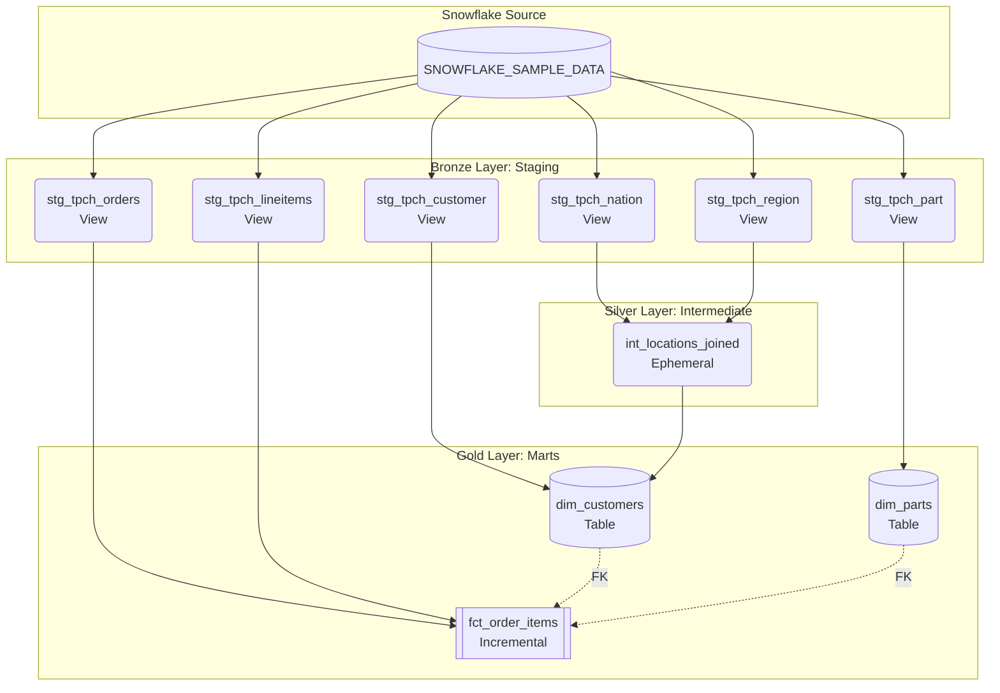

# TPC-H Dimensional Modeling with dbt & Snowflake

This project transforms the standard **Snowflake TPC-H Sample Dataset** (`SNOWFLAKE_SAMPLE_DATA.TPCH_SF1`) into a consumer-ready Star Schema. It leverages **dbt** to execute transformations using the **Medallion Architecture** (Bronze, Silver, Gold).

## 🏛️ High-Level Architecture

The pipeline extracts raw, highly normalized transactional data and processes it through three distinct layers to produce clean, optimized dimensional models for business intelligence and analytics.


### Data Flow & Lineage


# dbt Medallion Architecture on Snowflake

A lightweight dbt project implementing the **Medallion architecture** (Bronze → Silver → Gold) on **Snowflake**, with fast and reproducible Python dependency management via **uv**.

---

## Table of Contents

- [Layer Definitions](#layer-definitions)
- [Step-by-Step Environment Setup](#-step-by-step-environment-setup)
- [Project Structure](#project-structure)
- [Security Notes](#security-notes)
- [Troubleshooting](#troubleshooting)
- [License](#license)

---

## 📂 Layer Definitions

### Bronze Layer (`models/staging/`)
**Goal:** Create a clean foundation.  
**Actions:**
- Cast data types  
- Rename columns to `snake_case`  
- Generate surrogate keys  
- Apply basic `not_null` and `unique` testing  
- Materialized as lightweight **views**

---

### Silver Layer (`models/intermediate/`)
**Goal:** Handle complex, reusable business logic before the final layer.  
**Actions:**
- Denormalize highly relational components (e.g., joining **Nation** and **Region**)  
- Materialized as **ephemeral** to prevent unnecessary storage while keeping code DRY

---

### Gold Layer (`models/marts/`)
**Goal:** Deliver consumer-ready **Facts** and **Dimensions** (Star Schema).  
**Actions:**
- Final joins  
- Metric calculations (e.g., `discounted_price`)  
- Heavy testing (referential integrity, custom non-negative tests)  
- `fct_order_items` is materialized as **incremental** for optimized build times

---

## 🚀 Step-by-Step Environment Setup

This project uses **uv** for lightning-fast Python dependency management.

### 1) Install `uv`

If you don't have `uv` installed yet, install it globally on your machine:

**macOS / Linux (Bash):**
```bash
curl -LsSf https://astral.sh/uv/install.sh | sh
```

**Windows (PowerShell):**
```powershell
powershell -ExecutionPolicy ByPass -c "irm https://astral.sh/uv/install.ps1 | iex"
```

---

### 2) Clone the Repo & Sync Dependencies

Clone this repository and let `uv` automatically create your virtual environment and install all required packages based on `pyproject.toml` and `uv.lock`.

```bash
git clone <YOUR_REPOSITORY_URL>
cd dbt-medallion
uv sync
```

---

### 3) Activate the Virtual Environment

**macOS / Linux (Bash):**
```bash
source .venv/bin/activate
```

**Windows (PowerShell):**
```powershell
.venv\Scripts\activate
```

---

### 4) Configure Your dbt Profile (`profiles.yml`)

dbt needs a `profiles.yml` file to connect to your Snowflake account.  
Create or edit the file in your home directory:

- **macOS/Linux:** `~/.dbt/profiles.yml`  
- **Windows:** `C:\\Users\\<Your_Username>\\.dbt\\profiles.yml`

> ⚠️ **Security Note:** Replace `<YOUR_PASSWORD>` with your actual Snowflake password for `ANPHAM1123`. **Never commit real credentials to GitHub.**

```yaml
dbt_tpch:
  outputs:
    dev:
      account: PLCQGFK-WAB84100
      database: DBT_DB
      password: '<YOUR_PASSWORD>'
      role: ACCOUNTADMIN
      schema: dbt_dev
      threads: 1
      type: snowflake
      user: ANPHAM1123
      warehouse: COMPUTE_WH
  target: dev
```

---

### 5) Install dbt Packages and Run

Navigate into the dbt project folder to install macros (e.g., `dbt_utils`) and build the project in Snowflake:

```bash
cd dbt_tpch
dbt deps
dbt build
```

> The `dbt build` command compiles your project, runs tests, and builds tables/views in Snowflake.

---

### 6) Generate & View Documentation

To explore the data dictionary, column definitions, and lineage graphs visually:

```bash
dbt docs generate
dbt docs serve
```

This will open a browser tab at `http://localhost:8080` showing your project's documentation.

---

## Project Structure

```
dbt-medallion/
├─ dbt_tpch/
│  ├─ models/
│  │  ├─ staging/        # Bronze: type casting, renaming, surrogate keys, base tests
│  │  ├─ intermediate/   # Silver: reusable transforms, denormalization (ephemeral)
│  │  └─ marts/          # Gold: facts & dimensions (star schema, incremental facts)
│  ├─ macros/
│  ├─ seeds/
│  ├─ snapshots/
│  ├─ dbt_project.yml
│  └─ README.md
├─ pyproject.toml
├─ uv.lock
└─ README.md
```

---

## Security Notes

- **Do not** commit secrets (passwords, tokens) to version control.  
- Consider using **Snowflake key-pair authentication** or a **password manager** for local development.  
- Scope the `ACCOUNTADMIN` role down to least privilege for production environments.

---

## Troubleshooting

- **`profiles.yml` not found**: Ensure it’s in `~/.dbt/profiles.yml` (macOS/Linux) or `C:\\Users\\<You>\\.dbt\\profiles.yml` (Windows).  
- **Warehouse or role errors**: Verify the `warehouse`, `role`, and `schema` exist and your user has access.  
- **Slow builds**: Confirm `fct_order_items` (and other large facts) use **incremental** materialization and run with `--full-refresh` only when needed.

---

## License

This project is licensed under the **MIT License**. See `LICENSE` for details.

